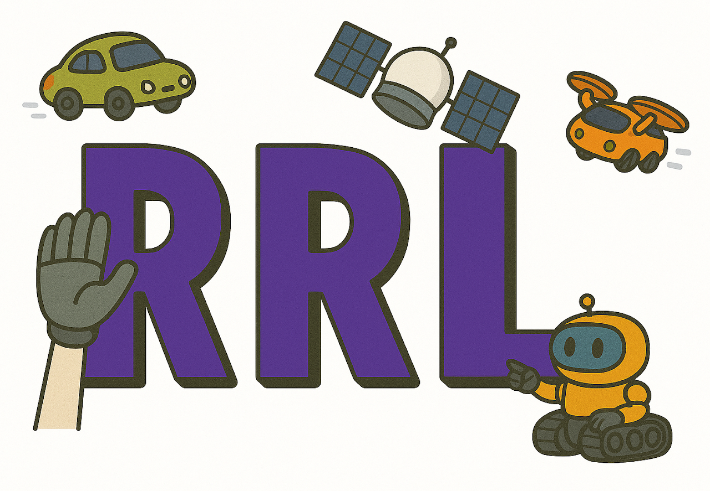

# Documentation for Riviere Robot Lab (RRL)


```{list-table}
:header-rows: 0
:class: noborder

* - {width="300px" alt="RRL"}
  - {width="300px" alt="NYU"}
```


Welcome! 


The purpose of this documentation page is to collect and distribute internal information on the Riviere Robot Lab (RRL). 


The docs page is built on [Sphinx](https://www.sphinx-doc.org/en/master/), which is a documentation generator. 
The docs are written in [MyST](https://myst-parser.readthedocs.io/en/latest/), an extension of Markdown, so it should be easy for everyone to contribute. 


```{toctree}
:maxdepth: 1

onboarding
safety
readmes/index
group_meetings/index
lab_conduct
contribute
```
